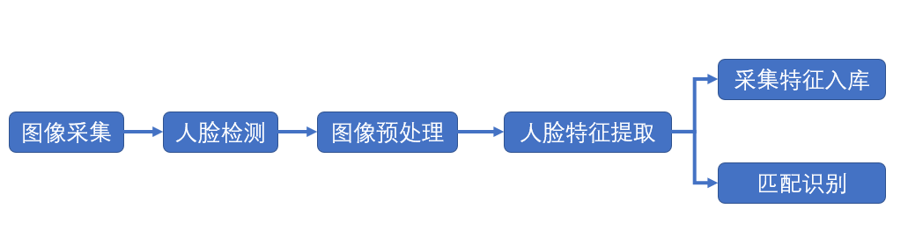
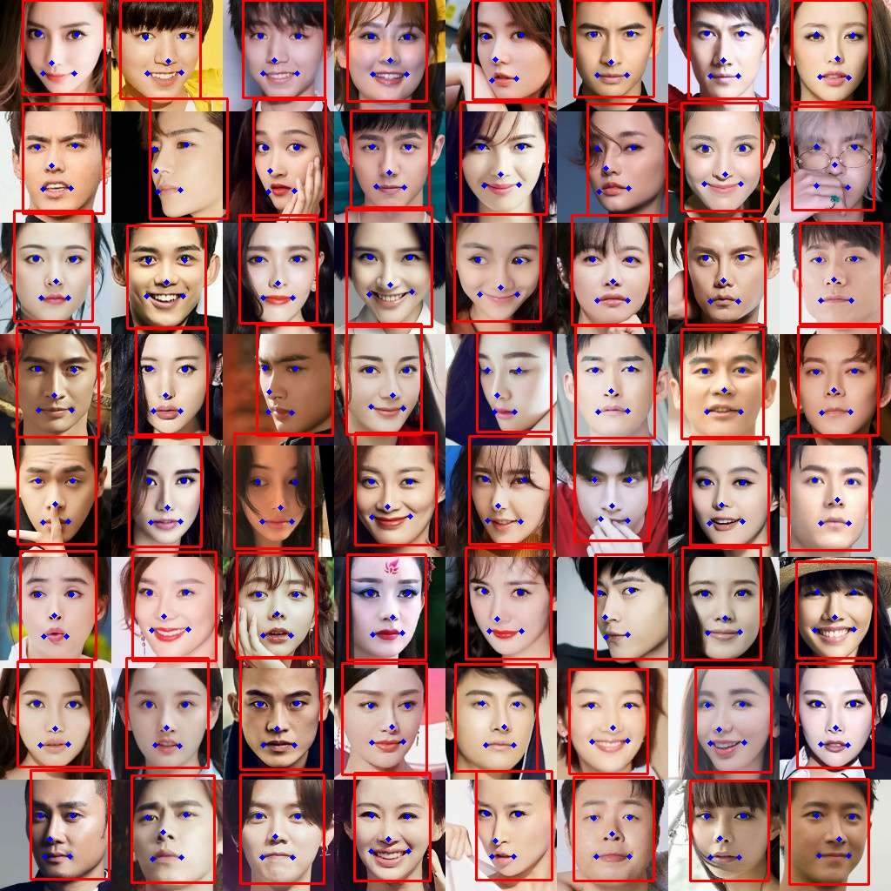
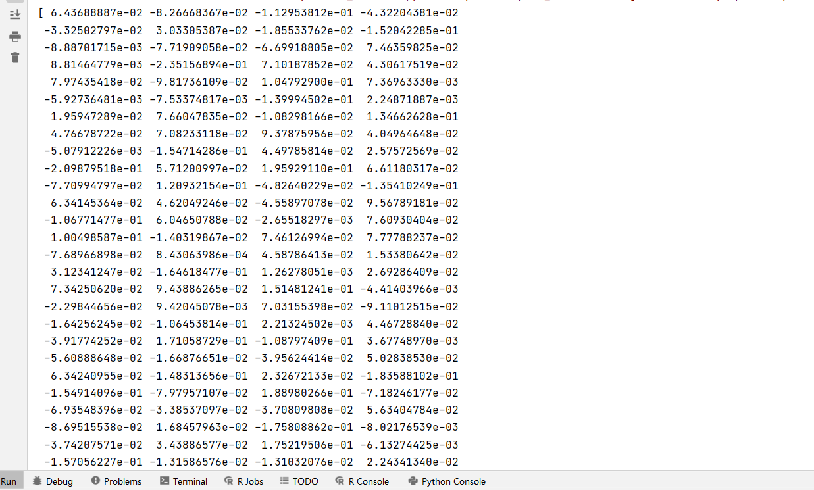
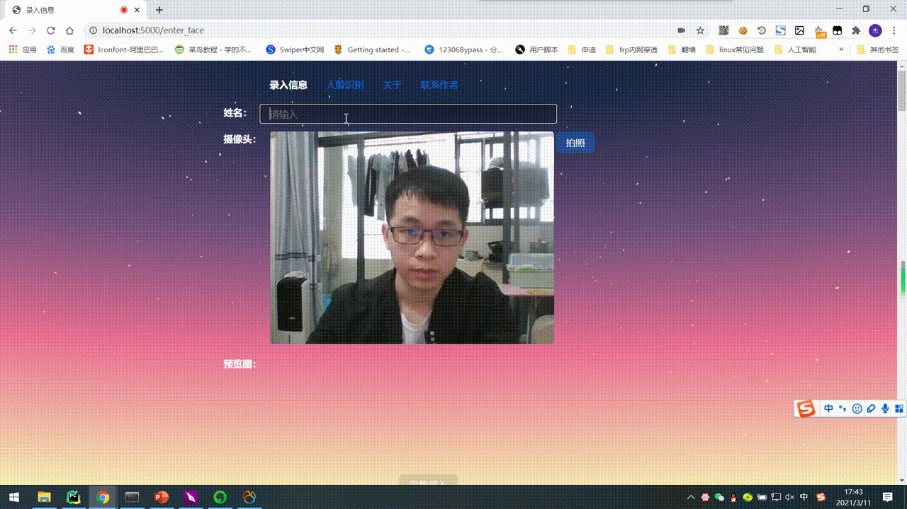

# face_recognition_by_keras

## 人脸识别主要流程

## 环境

python版本: 3.7

系统: Window10.

## 先安装好依赖

`pip install -r requirements.txt`

## TensorFlow-GPU安装

requirements中的是GPU版的TensorFlow

步骤参考 

https://www.jianshu.com/p/ba3015941446/

https://blog.csdn.net/sinat_16489689/article/details/104095529

CPU版的TensorFlow安装比较简单，但是训练比较慢

## 使用

按需修改 captcha_by_tensorflow/config.py 里面的配置

如果使用Mysql储存采集的人脸数据，修改 dataset_utils/DBUtils.py下的连接信息

### 测试人脸框定位
调用 mtcnn_master/test_mtcnn_detect.py 文件

`python mtcnn_master/test_mtcnn_detect.py`

图片来源于网络

## 测试人脸对齐
调用 facenet_master/test_align_face_img.py文件

`python facenet_master/test_align_face_img.py`

图片来源于网络

## 测试高斯滤波效果
调用 facenet_master/test_gaussian_blur.py文件

`python facenet_master/test_gaussian_blur.py`

图片来源于网络

## 测试获取人脸128维特征点
调用 facenet_master/test_get_calc_128_vec.py文件

`python facenet_master/test_get_calc_128_vec.py`

图片来源于网络

## 通过Web页面录入人脸和人脸识别

### 启动WebSocket服务

`python flaskapp_master/websocket/service.py`

### 启动Flask服务

`python flaskapp_master/app.py`

### 浏览器访问
采集人脸信息

http://localhost:5000/enter_face

识别人脸

http://localhost:5000/recognize_face

